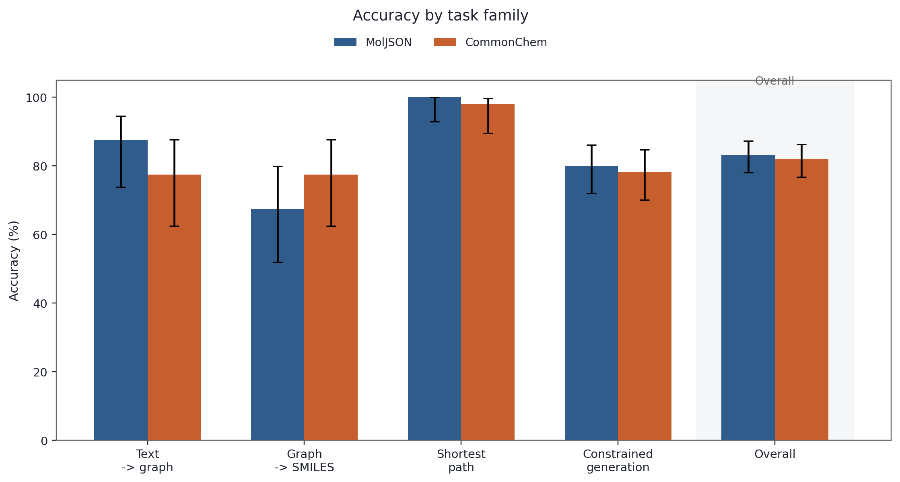
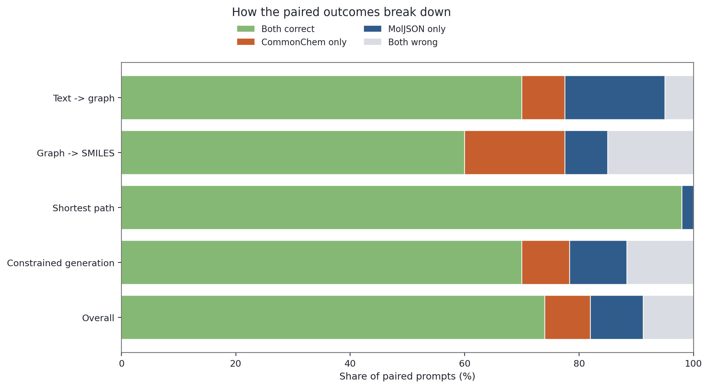

# A Response to “Molecular Representations for Large Language Models”

Nicholas Runcie, Prof. Fergus Imrie, and Prof. Charlotte Deane make an important claim in their recent paper, [_Molecular Representations for Large Language Models_](https://arxiv.org/html/2605.01822v1): the way we serialize molecules for LLMs matters a lot, and explicit graph schemas can outperform formats such as SMILES and IUPAC on structure-focused tasks.

I think that core claim is right.

But the paper leaves a natural and more practical follow-up question open: does MolJSON actually perform better than CommonChem, an already existing graph JSON format with RDKit support, or are we about to recreate the xkcd standards comic in cheminformatics form and solve “too many formats” by adding one more?


_xkcd 927 “Standards” by Randall Munroe, used under [CC BY-NC 2.5](https://xkcd.com/license.html)._

If MolJSON clearly beats CommonChem, then inventing a new format may be justified. If it does not, then the chemistry ecosystem may not need standard number 15.

To test that, I ran a small but representative follow-up using the authors’ benchmark, putting MolJSON vs CommonChem. The result is not that CommonChem wins. It does not. But it also does not lose decisively. On this 500-query structured-output run with GPT-5.4, MolJSON had a slight overall edge, but the difference was small and not statistically significant.

For the full artifact layout, rerun instructions, and raw outputs, see [REPRODUCIBILITY.md](REPRODUCIBILITY.md).

## Why this question matters

LLMs do not reason over native molecule objects internally. They consume text. That means any chemistry system built around an LLM has to choose how to turn a molecular graph into a text representation.

There are at least three broad options:

- Use a traversal-based string such as SMILES.
- Use a nomenclature-based text format such as IUPAC.
- Use an explicit graph serialization where atoms and bonds are written out directly in a structured form.

The MolJSON paper argues, convincingly, that the third category is much better suited to LLMs for structure-centered tasks. But their claim is a bit more specific than “JSON is good.” MolJSON was designed to be as simple and LLM-friendly as possible.

CommonChem is interesting because it is also an explicit molecular graph format, but it was not introduced in the paper. It already exists in the chemistry ecosystem and is already supported by RDKit. That makes it a good test case for a narrower question:

If we compare MolJSON not to SMILES or IUPAC, but to another explicit graph JSON format, do MolJSON's extra LLM-oriented design choices actually make it better?

## What are MolJSON and CommonChem?

Both MolJSON and CommonChem try to represent the same underlying object: a molecular graph.

A molecule can be thought of as:

- a list of atoms
- a list of bonds between those atoms
- a small number of additional fields needed to recover the correct chemistry

At a high level, both formats are graph JSON. The important question is how they ask the model to write that graph down.

MolJSON was explicitly designed for LLM use. In the paper's schema description, atoms are given unique string identifiers, bonds refer to those identifiers, and most hydrogens are left implicit rather than represented through heavier per-atom bookkeeping. A simplified example looks like this:

```json
{
  "atoms": [
    { "id": "C1", "element": "C" },
    { "id": "C2", "element": "C" },
    { "id": "O1", "element": "O" }
  ],
  "bonds": [
    { "source": "C1", "target": "C2", "order": 1 },
    { "source": "C2", "target": "O1", "order": 1 }
  ],
  "charges": null,
  "aromatic_n_h": null
}
```

CommonChem expresses the graph differently. Atoms are identified by array position rather than by free-form string identifiers, and atom records carry more chemistry-specific fields such as atomic number, hydrogen count, charge, isotope, and radical count:

```json
{
  "commonchem": 10,
  "molecules": [
    {
      "atoms": [
        { "z": 6, "impHs": 3, "chg": 0, "isotope": 0, "nRad": 0 },
        { "z": 6, "impHs": 2, "chg": 0, "isotope": 0, "nRad": 0 },
        { "z": 8, "impHs": 1, "chg": 0, "isotope": 0, "nRad": 0 }
      ],
      "bonds": [
        { "type": 1, "atoms": [0, 1] },
        { "type": 1, "atoms": [1, 2] }
      ]
    }
  ]
}
```

The practical difference is this:

- In MolJSON, a bond can say `"source": "C_acyl"` and `"target": "O_me"`. The model is free to choose readable atom IDs as long as they are unique.
- In CommonChem, a bond says `"atoms": [0, 1]`. That only works if the model keeps the atom array ordering perfectly consistent.
- In MolJSON, hydrogens are mostly implicit, with only sparse special-case fields for non-zero charges and aromatic nitrogens with hydrogens.
- In CommonChem, more of that information is pushed into every atom record through fields like `impHs`, `chg`, `isotope`, and `nRad`.

This question became more concrete for me after I asked publicly about `CommonChem` versus `MolJSON` and one of the authors replied in the LinkedIn discussion [here](https://www.linkedin.com/feed/update/urn:li:activity:7457396746617462785?commentUrn=urn%3Ali%3Acomment%3A%28activity%3A7457396746617462785%2C7457500746939437056%29&replyUrn=urn%3Ali%3Acomment%3A%28activity%3A7457396746617462785%2C7457556266471665664%29&dashCommentUrn=urn%3Ali%3Afsd_comment%3A%287457500746939437056%2Curn%3Ali%3Aactivity%3A7457396746617462785%29&dashReplyUrn=urn%3Ali%3Afsd_comment%3A%287457556266471665664%2Curn%3Ali%3Aactivity%3A7457396746617462785%29). That exchange reinforced the point that the interesting question is not just whether graph JSON helps, but whether MolJSON's specific design choices help enough to justify a new format.

That is exactly the follow-up question I wanted to test. If MolJSON is better because it is a graph JSON format in general, then CommonChem should be about as good. If MolJSON is better because these specific design choices matter for LLMs, then MolJSON should still outperform another graph JSON format like CommonChem.

So this comparison is not just “JSON vs JSON.” It is really a test of whether MolJSON's LLM-oriented simplifications are buying something over a more conventional positional graph schema.

## What the benchmark tasks are actually testing

The MolJSON paper’s benchmark is large, but the tasks themselves are easy to understand. They are designed to focus on reading, writing, and reasoning over molecular structure.

### 1. Translation

Translation asks the model to rewrite the same molecule in another format.

Two directions are especially useful here:

- `text -> graph`: Can the model take a SMILES string or IUPAC name and produce a valid graph object?
- `graph -> SMILES`: Can the model read a graph serialization and recover the correct molecule?

### 2. Shortest-path reasoning

In the shortest-path task, the model is shown a molecule and asked a graph question: how many bonds lie on the shortest path between two specified halogen atoms?

### 3. Constrained molecular generation

This is the most demanding task in the benchmark.

The model is asked to generate any valid molecule satisfying a bundle of graph constraints, for example:

- exact number of connected components
- exact number of rings
- ring sizes
- fused or spiro structure counts
- halogen counts
- shortest bond distances between halogens

## What I tested

This is not a full reproduction of the paper benchmark.

It is a targeted follow-up with a narrower goal: compare MolJSON and CommonChem directly on a representative subset of the same benchmark, specifically to test whether MolJSON's LLM-oriented schema design is what creates the advantage.

The run used:

- the benchmark from [MolJSON-data](https://github.com/oxpig/MolJSON-data)
- `gpt-5.4` through the OpenAI Responses API
- strict JSON-schema outputs for both MolJSON and CommonChem
- RDKit-derived CommonChem serializations from the benchmark SMILES

The subset contained 250 paired prompts, 500 total model calls:

- 40 text-to-graph translation pairs
- 40 graph-to-SMILES translation pairs
- 50 shortest-path reasoning pairs
- 120 constrained-generation pairs

The subset was selected to be diverse rather than random:

- translation examples were stratified by heavy-atom count and ring count
- shortest-path examples covered path lengths from 2 to 18 bonds, then added diverse extra cases
- constrained-generation examples were sampled across all five benchmark subcategories

## How the benchmark was run

A key detail is that the paper's OpenAI benchmark was run through the Responses API with structured outputs.

In the authors' OpenAI submission script, each benchmark row already contains a `prompt`, and that prompt is sent directly to the model. The output format is then enforced by a JSON schema:

```python
prompt = q["prompt"]
schema_name, schema = schema_for_format(fmt, moljson_schema)

client.responses.create(
    model=model,
    input=prompt,
    text={
        "format": {
            "type": "json_schema",
            "name": schema_name,
            "strict": True,
            "schema": schema,
        }
    },
)
```

In practice, the schema acts like an output contract. It tells the API what shape the answer must have before it is accepted. With `strict: True`, the model is not just being asked nicely to return JSON. It is being forced into a particular JSON structure.

For a graph format such as MolJSON, that schema can constrain a lot:

```python
{
    "type": "object",
    "properties": {
        "atoms": {"type": "array", ...},
        "bonds": {"type": "array", ...},
        "charges": {"type": ["array", "null"], ...},
        "aromatic_n_h": {"type": ["array", "null"], ...},
    },
    "required": ["atoms", "bonds", "charges", "aromatic_n_h"],
    "additionalProperties": False,
}
```

That means the API can enforce things like:

- the top-level answer must be a JSON object
- specific keys must be present
- atom and bond entries must have the right field names
- arrays, strings, integers, and nulls must appear in the right places
- extra unexpected keys are disallowed

For a string format such as `SMILES`, the schema is much lighter:

```python
{
    "type": "object",
    "properties": {
        "smiles": {"type": "string"}
    },
    "required": ["smiles"],
    "additionalProperties": False,
}
```

That still forces valid JSON at the wrapper level, but it does not constrain the internal structure of the chemistry representation in the same way.

This is the key disadvantage for `SMILES` in a structured-output setting. Almost the entire chemistry representation lives inside one unconstrained string, so the API cannot check ring closures, branching, atom ordering, or even whether the string is valid SMILES at all. By contrast, a graph JSON format exposes much more of its internal structure to the schema validator.

Just as importantly, the schema only checks structural validity, not chemical correctness. A response can satisfy the JSON schema and still describe the wrong molecule, an impossible graph, or the wrong shortest-path answer. So the schema helps with formatting and serialization discipline, but the chemistry still has to be evaluated separately.

For MolJSON graph tasks, the model is constrained by a rich graph schema. For string outputs such as `SMILES`, the schema usually just wraps a single string field. It's not completely an apples-to-apples comparison.

## How I adapted it for CommonChem

The CommonChem tests required two adaptations from the original benchmark:

- replace the MolJSON output schema with a CommonChem output schema
- adapt the prompt where the benchmark text explicitly referred to graph output or embedded a MolJSON graph object

For the CommonChem tests, I used a CommonChem schema in place of the MolJSON schema, and then adapted the prompt depending on the task family:

```python
{
    "representation": "commonchem",
    "schema": commonchem_schema,
}
```

For text-to-graph translation, I changed the requested target format from MolJSON graph to CommonChem:

```python
{
    "representation": "commonchem",
    "prompt": f"Convert the molecule from smiles to commonchem: {smiles}",
    "schema": commonchem_schema,
}
```

For graph-to-SMILES translation, I replaced the embedded MolJSON graph with a CommonChem object and changed the instruction accordingly:

```python
{
    "representation": "commonchem",
    "prompt": f"Convert the molecule from commonchem to smiles: {commonchem_obj}",
    "schema": smiles_wrapper_schema,
}
```

For shortest-path reasoning, I kept the same task but replaced the graph payload with CommonChem:

```python
commonchem_prompt = (
    "Determine the number of bonds along the shortest path "
    "connecting the two halogen atoms.\n\n"
    f"{commonchem_obj}\n\n"
    "Give your answer as an integer."
)

request = {
    "representation": "commonchem",
    "prompt": commonchem_prompt,
    "schema": integer_wrapper_schema,
}
```

For constrained generation, the prompt text stayed the same and only the output schema changed from MolJSON to CommonChem. That mirrors the original benchmark design, where the constrained-generation tasks rely heavily on the structured-output contract to determine the target representation.

For scoring:

- translation to graph was evaluated by parsing the returned graph and comparing canonical SMILES to the benchmark answer
- graph to SMILES was evaluated by canonicalizing the predicted SMILES
- shortest path used exact integer match
- constrained generation was evaluated by parsing the output and checking every requested graph constraint directly

## Results

- MolJSON accuracy: 83.2%
- CommonChem accuracy: 82.0%
- Exact McNemar `p = 0.761`

That is not a significant overall difference on this subset.

The McNemar test makes sense here because each MolJSON result is matched to a CommonChem result on the same underlying task. A `p`-value of `0.761` means the observed imbalance in pairwise wins and losses is entirely consistent with chance under the null hypothesis of no real difference. In plain terms: the data do not support a claim that one format clearly outperformed the other overall in this 500-query run.



_Figure 1. Absolute accuracy by task family with 95% Wilson confidence intervals._

By task family:

| Task                   | Pairs | MolJSON | CommonChem | CommonChem - MolJSON |
| ---------------------- | ----: | ------: | ---------: | -------------------: |
| Text to graph          |    40 |   87.5% |      77.5% |              -10.0 % |
| Graph to SMILES        |    40 |   67.5% |      77.5% |              +10.0 % |
| Shortest path          |    50 |  100.0% |      98.0% |               -2.0 % |
| Constrained generation |   120 |   80.0% |      78.3% |               -1.7 % |
| Overall                |   250 |   83.2% |      82.0% |               -1.2 % |

What stands out is that the two formats seem to trade advantages rather than one dominating the other:

- MolJSON was better on text-to-graph generation.
- CommonChem was better on graph-to-SMILES interpretation.
- Shortest-path reasoning was effectively tied.
- Constrained generation was also effectively tied on this slice.



_Figure 2. Breakdown of paired outcomes into both correct, CommonChem-only wins, MolJSON-only wins, and both wrong._

## What this says about the paper

I did not rerun the benchmark against `SMILES` or try to reproduce the paper’s broader claim that graph schemas outperform other chemistry text formats. The paper may still be completely right about that.

What I did here was narrower: I compared one graph JSON format against another graph JSON format.

So the question in this section is not:

- are graph schemas better than `SMILES`?

It is:

- if MolJSON was designed to be unusually LLM-friendly, is it actually better than an existing standard such as `CommonChem`?

On that narrower question, the answer from this 500-query run is: maybe a little, but not by much.

Overall, MolJSON performed well. It had the better point estimate on this subset, and it did not collapse against CommonChem. But this run does not show MolJSON in a clearly different league from an already existing standard.

- MolJSON is a strong explicit graph format for LLMs.
- CommonChem is also a strong explicit graph format for LLMs.
- On this subset, MolJSON had a small overall advantage, but not a statistically meaningful one.

So my read is that this particular follow-up leaves open a very practical possibility: an existing format like `CommonChem` may already capture much of the benefit of moving to explicit graph structure, even if MolJSON remains a well-designed option.

## Caveats

There are important limits on the work done here:

- This is a 500-query representative subset, not the paper’s full 78,045-question benchmark.
- I used `gpt-5.4`, not the paper’s `GPT-5` model.

## Takeaway

My thoughts after this experiment is:

- The paper is right that molecular representation strongly affects LLM performance.
- The paper is also right that explicit graph schemas are promising for chemistry LLM systems.
- But on this first graph-schema-vs-graph-schema comparison, MolJSON is not obviously in a different league from CommonChem.

## Next steps

- Rerun the same subset without specifying any output schema, so `SMILES`, `MolJSON`, and `CommonChem` are compared without the extra structure imposed by the API contract.
